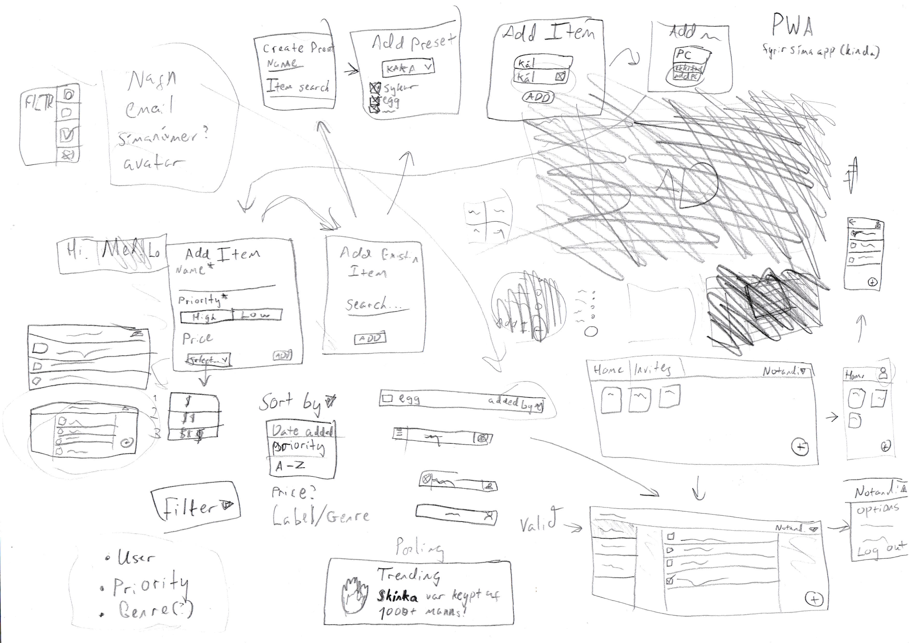

# shopping list or whatever

Fólk upplifir oft erfiðleika með að skipuleggja sameiginlega kaupferð eða halda utan um hvaða vörur þurfa að kaupa í hóp, sérstaklega þegar það er dreift yfir mismunandi staði.

Markmið okkar er Að búa til vefforrit sem auðveldar fólki að búa til, breyta og fylgjast með sameiginlegum innkaupalista milli meðlima í hóp.

### user stories:

ég er lil piss baby og kann bara á ipad
- búmm! ipad support

ég er aleitt foreldri með 4 börn heima sem vantar mat
- þau geta sett inn hvað vantar og þú getur kíkt

ég er 90 ára og nenni ekki að senda á einhvern að kaupa fyrir mig
- þetta er honestly örugglega erfiðara en samt

ég spila fortnite allan daginn
- bleyju sendingar daglega með premium subscription

# Initial hugmynd

ég skil ~~ekkert~~ hvað er í gangi á þessari mynd
